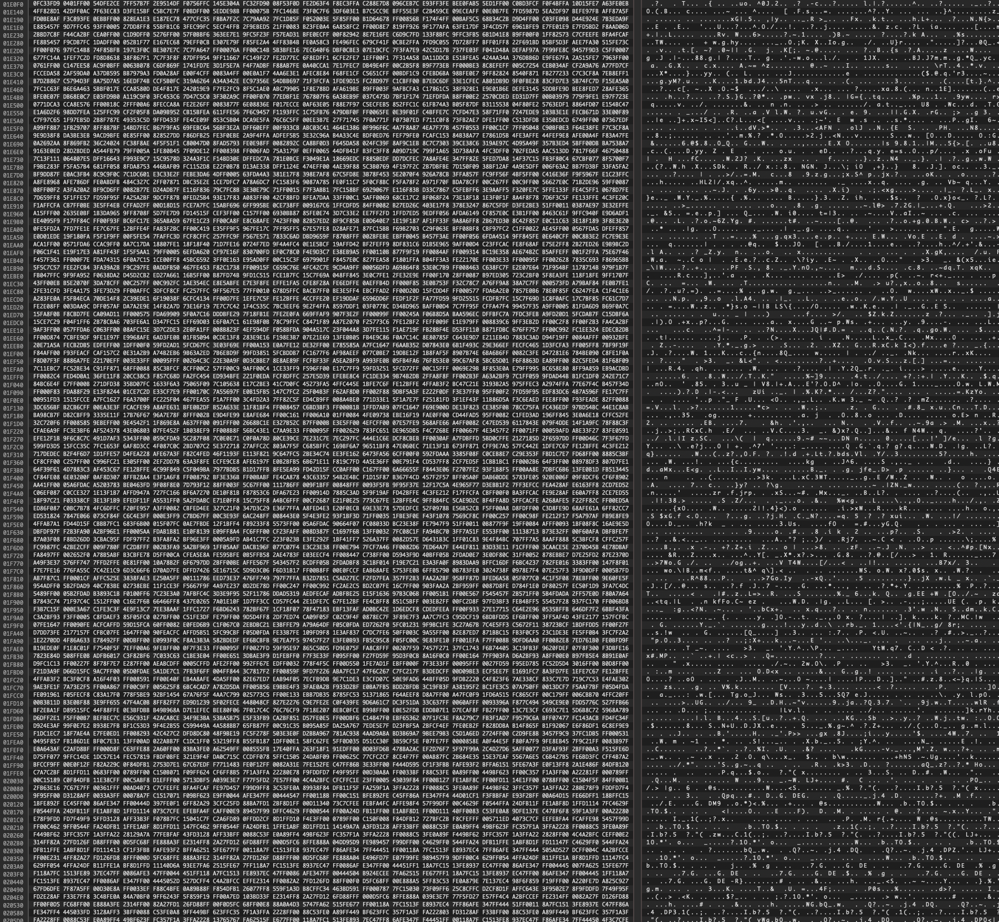
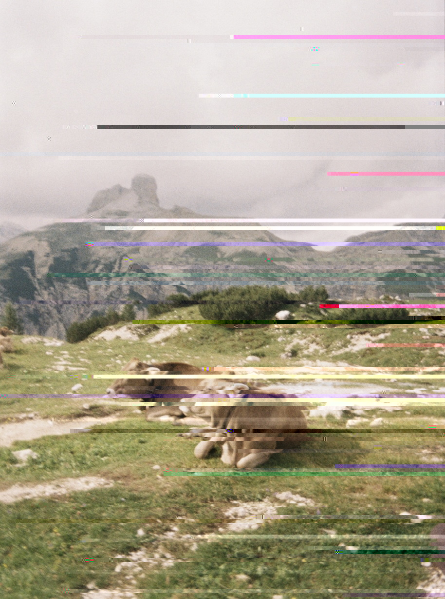
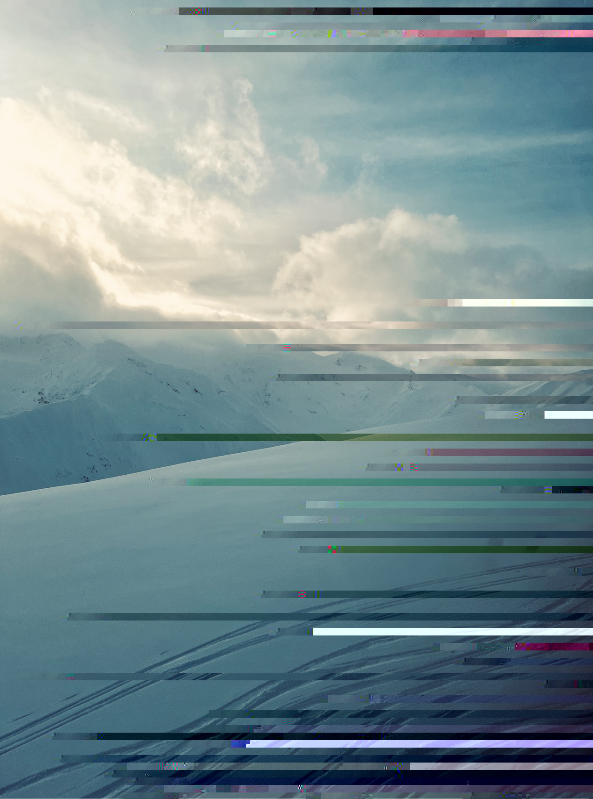

# Getting Glitchy Wid It
My JPEG Glitch Art Exploration
### Creative Coding Exploration 1

## What is it? 
In this project, I manually manipulated JPEG file structures at the hex level to create intentional visual corruption of some of the pictures I've taken recently, exploring how digital images encode information and investigating databending as an aesthetic practice, and the tension between digital and analog representation.

## Motivation
I created this as commentary on analog versus digital—taking film photographs of mountains, snow, water, and cowboy/western scenes that represent traditional human connections to nature, then deliberately corrupting them with digital processes. I was curious about what happens when you layer digital failure onto analog nostalgia, and whether the corruption reveals something about how digital systems translate (or betray) physical reality.

## Inspiration
My primary inspirations came from the glitch art community, particularly:

Rosa Menkman - Her work on [compression artifacts](https://www.youtube.com/watch?v=fAxHlLK3Oyk) and the "Glitch Moment/um" showed me how technical failures can become aesthetic choices
Hito Steyerl - Her video installations dealing with [image degradation and circulation](https://www.nytimes.com/2017/12/15/arts/design/hito-steyerl.html) influenced my thinking about digital materiality
Data Erase - Their [systematic approach to databending](https://dataerase.neocities.org/about) demonstrated methodical exploration of corruption techniques
Faultlore - [Documentation of glitch techniques](https://faultlore.com/glitch/) provided practical starting points
Beyond Resolution collective - Their project ["MPEG Dear Mr. Compression"](https://beyondresolution.info/MPEG-Dear-mr-Compression) reframed compression as a creative constraint

I drew on e-flux's essay ["The Spam of the Earth"](https://www.e-flux.com/journal/32/68260/the-spam-of-the-earth-withdrawal-from-representation) for conceptual framing around digital representation and withdrawal.

I was also inspired by Alvin Lucier's ["I am sitting in a room"](https://www.youtube.com/watch?v=fAxHlLK3Oyk), in which he records and re-records a loop of audio, and it becomes more and more corrupted and warped. I would seriously recommend sitting in a room and listening to the whole 45 minutes. 

## Starting Point: What exactly is a JPG and how the heck does it work?

I started by trying to understand the basics of JPEG structure through [this freeCodeCamp article](https://www.freecodecamp.org/news/how-jpg-works-a4dbd2316f35/). The key thing I learned: JPEGs have a header section and a data section, separated by the hex code `FF DA`. Editing the header = totally corrupting the file. All the fun happens in the data section.

## Beginning to work in the hex editor

I started experimenting with a film photo from this past summer of some cows resting in the mountains. There are only a few places to edit within the header without totally corrupting the file, and I haven't quite figured that out yet. Within the body, I've been adjusting a mix of large blocks of hex data and moving it to different places in the image, hoping to get a sort of glitch effect.

**mountains1.jpeg:** I somewhat randomly copied sections of hex code and moved it to other places in the file. The effect was some horizontal streaks across the image, often becoming grey, rather than the warping/glitching effect I was hoping for.

**mountains2.jpeg:** I tried editing smaller segments of hex code more often, replacing 8-bit sections with the hex code of the word "luddites." This led to a similar horizontal streak effect. Some of the streaks looked like an interesting image translation, but most were greyed out color blocks. I read that the greyed pixels meant that there was some sort of corruption that led to the JPEG not being able to compile at all. I looked to see if there was a certain hex code that caused the issue or a placement, but it felt random.

**mountains3.jpeg and mountains4.jpeg:** I tried moving larger chunks of the hex file to different places. This worked better than the smaller changes! While there was still some grey, the swapping of sections of image were somewhat recognizable. It gives the appearance of the image being "split." I prefer the larger chunks (like mountains 4).

This may be harder than I thought! I'm disappointed in the amount of grey, and have to figure out why that is happening. I've read all about DCT, but haven't really incorporated the mathematics into this initial exploration just yet.

**Interesting aside:** The images display differently on my computer vs here on GitHub. What the heck is going on here?! I looked into this a little, and it appears that a lot of angry people on Reddit think little of Mac's Preview.

## Trying to automate the process (spoiler: it didn't work)

In later iterations, I attempted to add some pattern and consistency to the process by writing a few short scripts to parse the image data and make changes after a set number of hex codes. Unfortunately, like I experienced with the manual process, there didn't seem to be a noticeable pattern to what broke the file or turned the pixels grey. Trying to use the consistent looping pattern only seemed to break my files.

I'm getting an idea of the size needed for successful manipulation. I tried word insertion, but so far the difference isn't noticeable (maybe I'll need to write a script for these additions en masse?).

## Testing with a different image

I wanted to see if the same horizontal line effects would happen for a different image than the mountains one I started with. I used a new image, this time of snowy mountains I took last January to see what the same process might look like.

It did have a similar effect as earlier, streaking the image horizontally (see snow2.jpeg). I again tried using a script to automate the process, with no success. I figured that if I could manually figure out how to make one image look the way I wanted, I could then automate later.

## Working with DCT and smaller images

I'd been reading about Direct Cosine Transformations (DCTs), and since I couldn't seem to reason out a pattern to the madness, I sized the image quality down significantly, reducing its number of pixels.

**small-snow-1.jpeg:** I did a similar pixel replacement method, and was pleased to see the effects of the DCT when the pixels were so much larger in comparison to the whole image.

**small-snow-2.jpg:** I added to the size of the file by randomly frequently adding the hex value `20202020 20202020 206C6F76 65202020 20202020 20202020`, which looks like "         love           " in ASCII (the spaces to help me find my edits easier).

While I liked the look of both abstractions, it felt like it was still random and hard to control.

## Going bigger: The 6400px experiment

I went back to the drawing board and read a lot from other glitch artists. In one YouTube tutorial, I learned that the horizontal streak effect often occurs because the image isn't big enough. With really large images (and thus super tiny pixels), the effects appear really different. I didn't have any images the size the video suggested, so I attempted to size up an image I already had that was pretty big.

Now with a resized, large 6400px × 6400px image, I started following my (now customary) practice of randomly moving about sections of the hex file within the image.

The pixels seemed to grey out all the time, and grey everything that followed it. This seemed like going backwards!

## The deletion breakthrough

Frustrated, I just started deleting at random sections of the image. This ended up leading to the most interesting effect yet! The image started to split and move in a way I liked, and it became clear that some bits moved the image, while others changed its coloring or luminance. It still was finicky — if I deleted the wrong values, the image would go completely grey again, so I had to carefully pick my way through the file. See hat copy.jpg.

To see what just a singular deletion of a bit might look like, check out hat copy - singular deletion.jpeg.

In the next iteration, I honed in more on specific bits to get the color and movement effect to my liking, often deleting then re-adding, moving a few hex codes to the right or left of the area I was working on, and then continuing again. Documented in hat copy 2.jpg.

## The painful bit replacement experiment

In one of the tutorials I watched, the artist recommended making a minor change to the same bit over and over. At random, I picked `02` and replaced nearly every hex with `33` instead. I figured that would be a significant enough numerical change that the effects would be noticeable.

Indeed they were! Not every `02` is replaced though — some of them would just immediately cause the rest of the file to grey out, so I would not change that particular instance and then move to the next one. This was incredibly painstaking given that my hex editor was not a live editor, so I one by one made the changes.

**I would really not recommend this to anyone, not even my worst enemy.** And now I think I have a twitch in my hand from doing this.

I do think I have a better understanding of how color is coded into JPEG files with this experiment, as luminance and chrominance seem to be the final product of the abstraction. I included screenshots (4a and 4b) that show different changes of what the image looked like at different stages in the process.

Earlier stages:

Midway through:

Unfortunately, I think the process of changing these bits, or maybe my choice in replacement was too dramatic, because the visual came out extremely abstracted. I'd like to explore that more, but the process was a slog and I haven't worked up the courage for Round Two.

The final effect:

## Addition method: "ephemeral"

Now that I had tried deletion and replacement, I wanted to try addition with the same image. See: hat copy 4. Using the bitwise representation of the word "ephemeral," I randomly and frequently added to the file. The color look changes drastically between VSCode photo viewer and MacOS's Preview.

VSCode View:

Mac Preview:

## Grid decomposition experiment

The next thing that I did was working within smaller jpgs. So I took an image I took of a lake sunset, divided it into 20 smaller images using a 5 by 4 grid. Then I sized each of the gridded images to be 32 by 32 pixels.

**Process:**
1. Located the start of the data file (end of the header) with the hex code `FF DA`
2. Deleted 2 bytes from the same place in each image (10 bytes after the end of the header)
3. Replaced the images back on the grid to get a final product

It was interesting that some didn't change at all and others were totally corrupted.

## What's next

Future work: I want to learn the `ffmpeg` tool. This is a powerful command line tool for image/video manipulation.

## Key Takeaways

- **Larger chunks work better** than small edits for creating interesting glitch effects
- **Deletion is more effective** than movement or replacement for controlled manipulation
- **Different viewers render glitched images completely differently** (Mac Preview vs VSCode vs GitHub)
- **Automation didn't work** — manual intuition was more successful than systematic scripts
- **Grey pixels = corruption** where the JPEG can't compile properly
- **No consistent pattern** emerged for what would corrupt vs. create aesthetic glitches
- **DCT effects are visible** when pixels are large relative to image size
- **Some bits control movement, others control color/luminance**

## Acknowledgments

**Thank you to the creators of these resources for explanations!**
- [ComputerPhile: How JPEG works](https://www.youtube.com/watch?v=Tq-Ly_Gz5ws)
- [More JPEG Explanations](https://cgjennings.ca/articles/jpeg-compression/)
- [Stack Exchange: Methods to deliberately corrupt images](https://graphicdesign.stackexchange.com/questions/116532/is-there-any-method-to-deliberately-digitally-corrupt-an-image)
- [Data Moshing tutorial](http://datamoshing.com/2016/06/15/how-to-glitch-jpg-images-with-data-corruption/)
- [Data Bending Tutorial](https://famst109ga.wordpress.com/code/)
- [Hex Editing](https://www.youtube.com/watch?v=VrU_uleQTm8)
- [Glitch Corruptions](https://artblueprint.substack.com/p/the-beautiful-corruptions-of-glitch)

**And thank you for the artitsts that inspired my exploration. I am even more in awe of your creations now.**
- [Faultlore](https://faultlore.com/glitch/)
- [Data Erase](https://dataerase.neocities.org/about)
- [Rosa Menkman](https://www.youtube.com/watch?v=fAxHlLK3Oyk)
- [Beyond Resolution: MPEG Dear Mr. Compression](https://beyondresolution.info/MPEG-Dear-mr-Compression)
- [Hito Steyerl - NY Times](https://www.nytimes.com/2017/12/15/arts/design/hito-steyerl.html)
- [The Spam of the Earth - e-flux](https://www.e-flux.com/journal/32/68260/the-spam-of-the-earth-withdrawal-from-representation)
- [Alvin Lucier: I am sitting in a room](https://www.youtube.com/watch?v=fAxHlLK3Oyk)

*All experiments documented with visual examples in accompanying image files*
